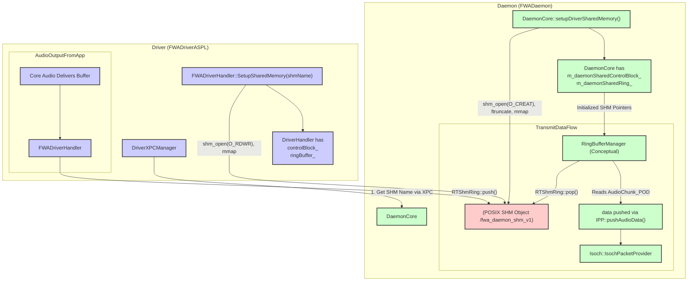

```mermaid
graph TD
    subgraph DaemonProcess ["Daemon (FWADaemon)"]
        DC[DaemonCore]
        IPP[Isoch::IsochPacketProvider]
        RBMDaemon["RingBufferManager (Conceptual)"]

        DCSetup["DaemonCore::setupDriverSharedMemory()"]
        DCSetup -- "shm_open(O_CREAT), ftruncate, mmap" --> SHMOS["(POSIX SHM Object /fwa_daemon_shm_v1)"]
        DCSetup --> DCPointers["DaemonCore has<br>m_daemonSharedControlBlock_<br>m_daemonSharedRing_"];
        DCPointers -- "Initialized SHM Pointers" --> RBMDaemon;

        subgraph TransmitDataFlow
            RBMDaemon -- "RTShmRing::pop()" --> SHMOS;
            RBMDaemon -- "Reads AudioChunk_POD" --> DataPushedToIPP["data pushed via IPP::pushAudioData()"];
            DataPushedToIPP --> IPP;
        end
    end

    subgraph DriverProcess ["Driver (FWADriverASPL)"]
        DH[FWADriverHandler]
        XPCMgrDriver[DriverXPCManager]

        XPCMgrDriver -- "1. Get SHM Name via XPC" --> DC;
        DHSetup["FWADriverHandler::SetupSharedMemory(shmName)"]
        DHSetup -- "shm_open(O_RDWR), mmap" --> SHMOS;
        DHSetup --> DHPointers["DriverHandler has<br>controlBlock_<br>ringBuffer_"];

        subgraph AudioOutputFromApp
            CoreAudio[Core Audio Delivers Buffer] --> DH;
            DH -- "RTShmRing::push()" --> SHMOS;
        end
    end

    %% Styling
    classDef daemon fill:#cfc,stroke:#333,stroke-width:2px;
    classDef driver fill:#ccf,stroke:#333,stroke-width:2px;
    classDef os fill:#fcc,stroke:#333,stroke-width:2px;

    class DC,IPP,RBMDaemon,DCSetup,DCPointers,DataPushedToIPP daemon;
    class DH,XPCMgrDriver,DHSetup,DHPointers,CoreAudio driver;
    class SHMOS os;
```