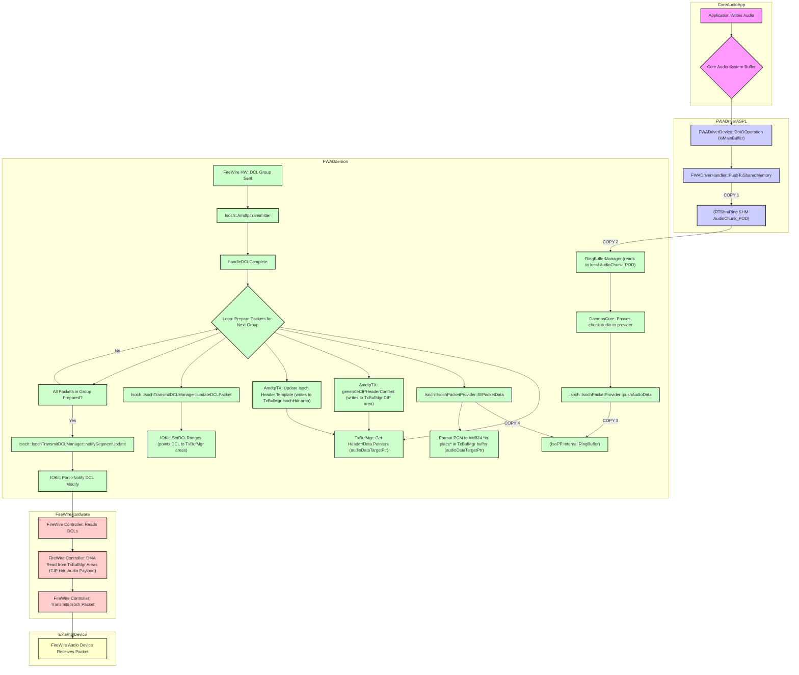

```mermaid
graph TD
    subgraph CoreAudioApp
        A[Application Writes Audio] --> B{Core Audio System Buffer};
    end

    subgraph FWADriverASPL
        B --> C["FWADriverDevice::DoIOOperation (ioMainBuffer)"];
        C --> D[FWADriverHandler::PushToSharedMemory];
        D -- COPY 1 --> E["(RTShmRing SHM AudioChunk_POD)"];
    end

    subgraph FWADaemon
        E -- COPY 2 --> F["RingBufferManager (reads to local AudioChunk_POD)"];
        F --> G[DaemonCore: Passes chunk.audio to provider];
        G --> H[Isoch::IsochPacketProvider::pushAudioData];
        H -- COPY 3 --> I["(IsoPP Internal RingBuffer)"];

        J[FireWire HW: DCL Group Sent] --> K[Isoch::AmdtpTransmitter];
        K --> L[handleDCLComplete];
        L --> M{Loop: Prepare Packets for Next Group};
        M --> N["TxBufMgr: Get Header/Data Pointers (audioDataTargetPtr)"];
        M --> O[Isoch::IsochPacketProvider::fillPacketData];
        O -- COPY 4 --> I;
        %% Read from internal buffer
        O --> P["Format PCM to AM824 *in-place* in TxBufMgr buffer (audioDataTargetPtr)"];
        M --> Q["AmdtpTX: generateCIPHeaderContent (writes to TxBufMgr CIP area)"];
        Q --> N;
        M --> R["AmdtpTX: Update Isoch Header Template (writes to TxBufMgr IsochHdr area)"];
        R --> N;
        M --> S[Isoch::IsochTransmitDCLManager::updateDCLPacket];
        S --> T["IOKit: SetDCLRanges (points DCL to TxBufMgr areas)"];
        M --> U[All Packets in Group Prepared?];
        U -- Yes --> V[Isoch::IsochTransmitDCLManager::notifySegmentUpdate];
        U -- No --> M;
        V --> W["IOKit: Port->Notify DCL Modify"];
    end

    subgraph FireWireHardware
        W --> X[FireWire Controller: Reads DCLs];
        X --> Y["FireWire Controller: DMA Read from TxBufMgr Areas (CIP Hdr, Audio Payload)"];
        Y --> Z[FireWire Controller: Transmits Isoch Packet];
    end

    subgraph ExternalDevice
        Z --> Z1[FireWire Audio Device Receives Packet];
    end

    %% Styling
    classDef app fill:#f9f,stroke:#333,stroke-width:2px;
    classDef driver fill:#ccf,stroke:#333,stroke-width:2px;
    classDef daemon fill:#cfc,stroke:#333,stroke-width:2px;
    classDef hardware fill:#fcc,stroke:#333,stroke-width:2px;
    classDef external fill:#ffc,stroke:#333,stroke-width:2px;

    class A,B app;
    class C,D,E driver;
    class F,G,H,I,J,K,L,M,N,O,P,Q,R,S,T,U,V,W daemon;
    class X,Y,Z hardware;
    class Z1 external;
```