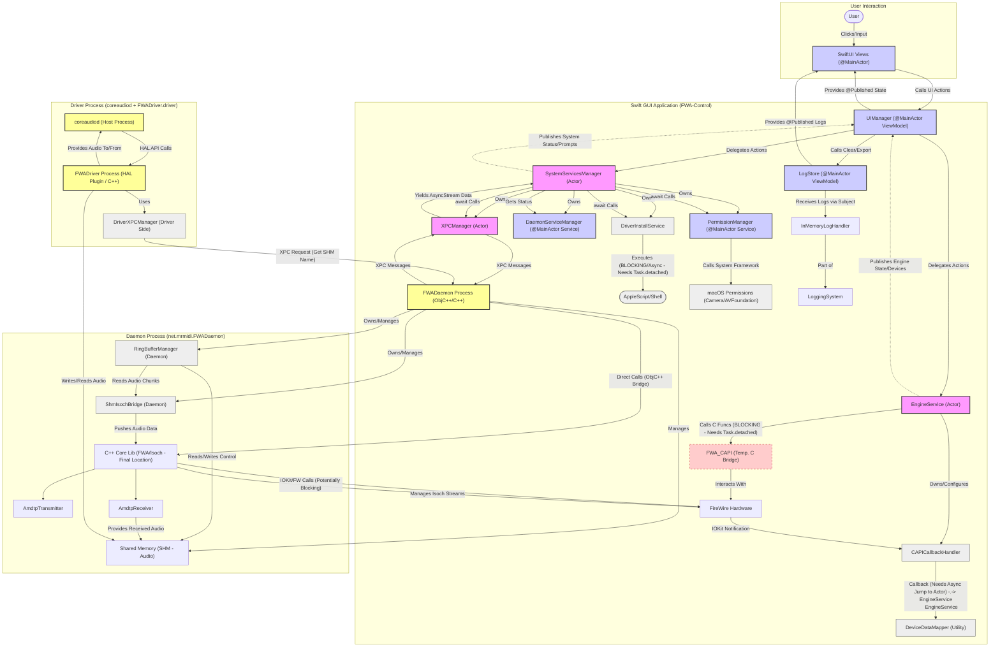

```mermaid
graph TD
    subgraph "User Interaction"
        User([User]) -- Clicks/Input --> SwiftUIViews["SwiftUI Views (@MainActor)"]
    end

    subgraph "Swift GUI Application (FWA-Control)"
        SwiftUIViews -- Calls UI Actions --> UIManager["UIManager (@MainActor ViewModel)"]
        UIManager -- Provides @Published State --> SwiftUIViews
        UIManager -- Delegates Actions --> EngineService["EngineService (Actor)"]
        UIManager -- Delegates Actions --> SystemServicesManager["SystemServicesManager (Actor)"]
        UIManager -- Calls Clear/Export --> LogStore["LogStore (@MainActor ViewModel)"]
        LogStore -- Provides @Published Logs --> SwiftUIViews

        %% Engine Service Interactions (Current Temporary State using C-API Bridge)
        EngineService -- Owns/Configures --> CAPICallbackHandler["CAPICallbackHandler"]
        EngineService -- Calls C Funcs (BLOCKING - Needs Task.detached) --> FWACAPI["FWA_CAPI (Temp. C Bridge)"]
        FWACAPI -- Interacts With --> Hardware["FireWire Hardware"]
        Hardware -- IOKit Notification --> CAPICallbackHandler
        CAPICallbackHandler -- Callback (Needs Async Jump to Actor) -.-> EngineService

        %% Engine Service Interactions (Data Processing)
        EngineService --> DeviceDataMapper["DeviceDataMapper (Utility)"]

        %% System Services Manager Interactions
        SystemServicesManager -- Owns --> XPCManager["XPCManager (Actor)"]
        SystemServicesManager -- Owns --> DaemonServiceManager["DaemonServiceManager (@MainActor Service)"]
        SystemServicesManager -- Owns --> DriverInstallService["DriverInstallService"]
        SystemServicesManager -- Owns --> PermissionManager["PermissionManager (@MainActor Service)"]

        SystemServicesManager -- await Calls --> XPCManager
        XPCManager -- XPC Messages --> FWADaemon["FWADaemon Process (ObjC++/C++)"]
        XPCManager -- Yields AsyncStream Data --> SystemServicesManager

        SystemServicesManager -- Gets Status --> DaemonServiceManager
        SystemServicesManager -- await Calls --> DriverInstallService
        DriverInstallService -- Executes (BLOCKING/Async - Needs Task.detached) --> AppleScript([AppleScript/Shell])

        SystemServicesManager -- await Calls --> PermissionManager
        PermissionManager -- Calls System Framework --> MacOSPermissions["macOS Permissions (Camera/AVFoundation)"]

        %% State Updates Back to UI (Need Publishers/Streams)
        EngineService -.->|Publishes Engine State/Devices| UIManager
        SystemServicesManager -.->|Publishes System Status/Prompts| UIManager
        LogStore -- Receives Logs via Subject --> InMemoryLogHandler -- Part of --> LoggingSystem

    end

    subgraph "Daemon Process (net.mrmidi.FWADaemon)"
        FWADaemon -- XPC Messages --> XPCManager
        FWADaemon -- Owns/Manages --> RingBufferManager_Daemon["RingBufferManager (Daemon)"]
        FWADaemon -- Owns/Manages --> ShmIsochBridge_Daemon["ShmIsochBridge (Daemon)"]
        FWADaemon -- Manages --> SharedMemory["Shared Memory (SHM - Audio)"]

        %% Daemon - Final Architecture Interactions (Target State)
        FWADaemon -- Direct Calls (ObjC++ Bridge) --> CppCore["C++ Core Lib (FWA/Isoch - Final Location)"]
        CppCore -- IOKit/FW Calls (Potentially Blocking) --> Hardware
        CppCore -- Manages Isoch Streams --> Hardware

        %% Daemon - SHM Interaction
        RingBufferManager_Daemon -- Reads/Writes Control --> SharedMemory
        RingBufferManager_Daemon -- Reads Audio Chunks --> ShmIsochBridge_Daemon
        ShmIsochBridge_Daemon -- Pushes Audio Data --> CppCore --> IsochTx["AmdtpTransmitter"]
        CppCore --> IsochRx["AmdtpReceiver"] -- Provides Received Audio --> SharedMemory


    end

    subgraph "Driver Process (coreaudiod + FWADriver.driver)"
        CoreAudio["coreaudiod (Host Process)"] -- HAL API Calls --> FWADriver["FWADriver Process (HAL Plugin / C++)"]
        FWADriver -- Provides Audio To/From --> CoreAudio

        %% Driver - XPC & SHM
        FWADriver -- Uses --> DriverXPCManager["DriverXPCManager (Driver Side)"]
        DriverXPCManager -- XPC Request (Get SHM Name) --> FWADaemon
        FWADriver -- Writes/Reads Audio --> SharedMemory
    end

    %% Style Definitions
    classDef actor fill:#f9f,stroke:#333,stroke-width:2px;
    classDef mainactor fill:#ccf,stroke:#333,stroke-width:2px;
    classDef process fill:#ff9,stroke:#333,stroke-width:2px;
    classDef utility fill:#eee,stroke:#666,stroke-width:1px;
    classDef temp fill:#fcc,stroke:#c33,stroke-width:1px,stroke-dasharray: 5 5;

    class UIManager,LogStore,SwiftUIViews,DaemonServiceManager,PermissionManager mainactor;
    class EngineService,SystemServicesManager,XPCManager actor;
    class FWADaemon,FWADriver,CoreAudio process;
    class FWACAPI temp;
    class DeviceDataMapper,DriverInstallService,CAPICallbackHandler,RingBufferManager_Daemon,ShmIsochBridge_Daemon,DriverXPCManager,AppleScript,MacOSPermissions utility;
```